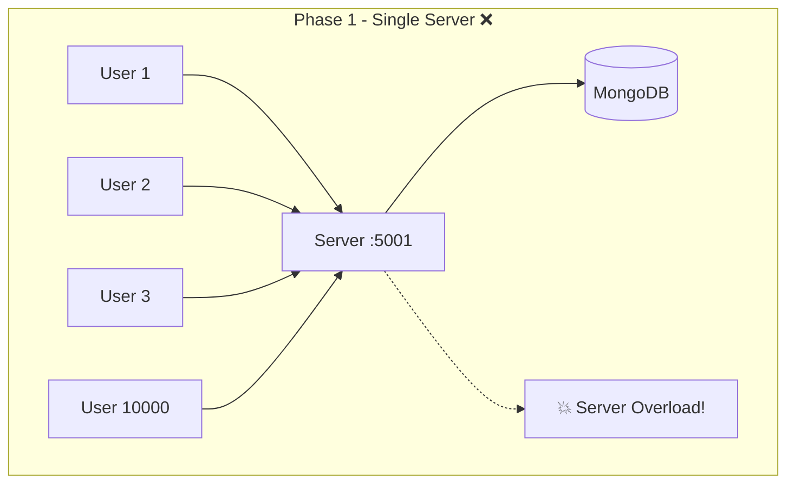
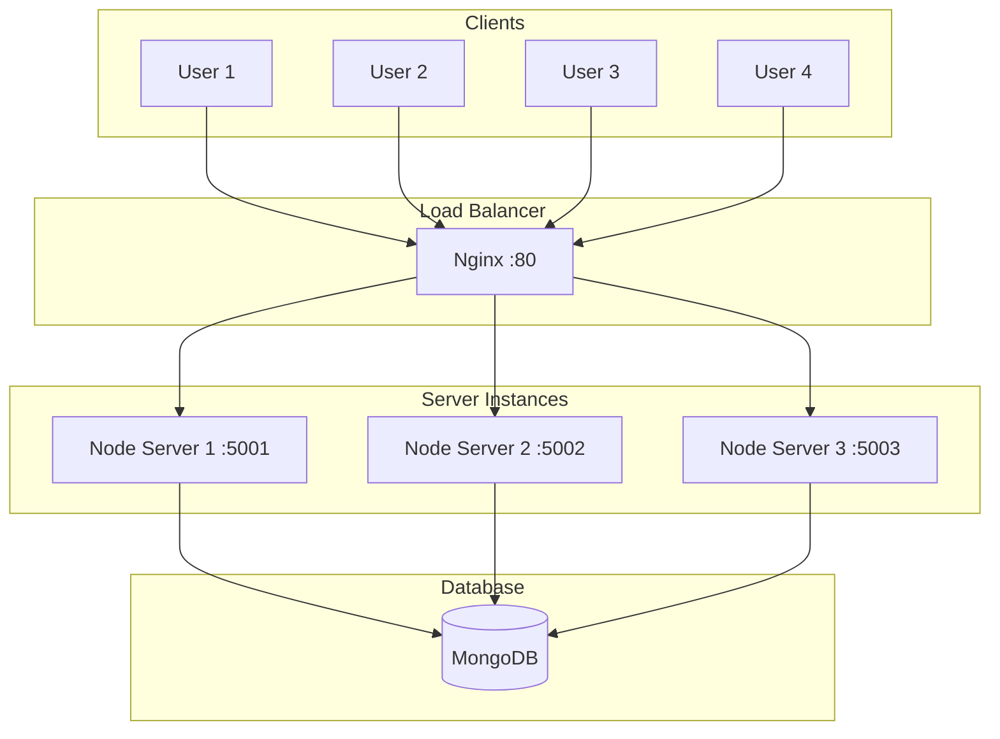
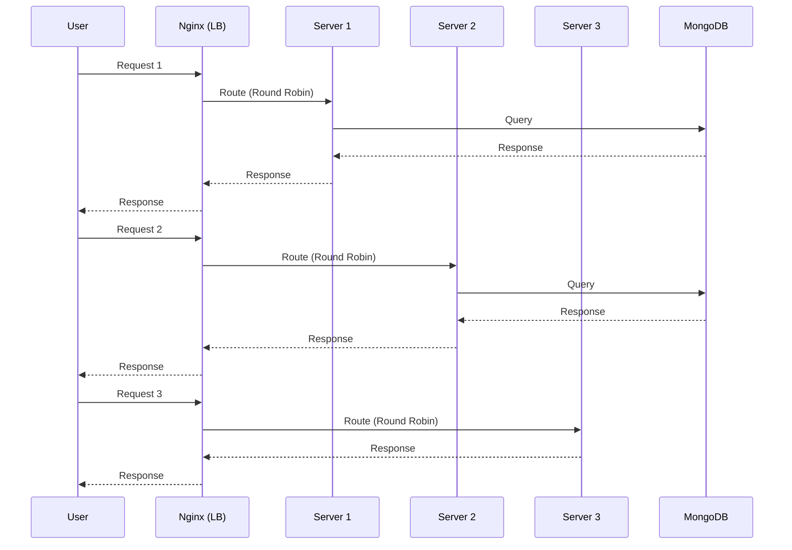
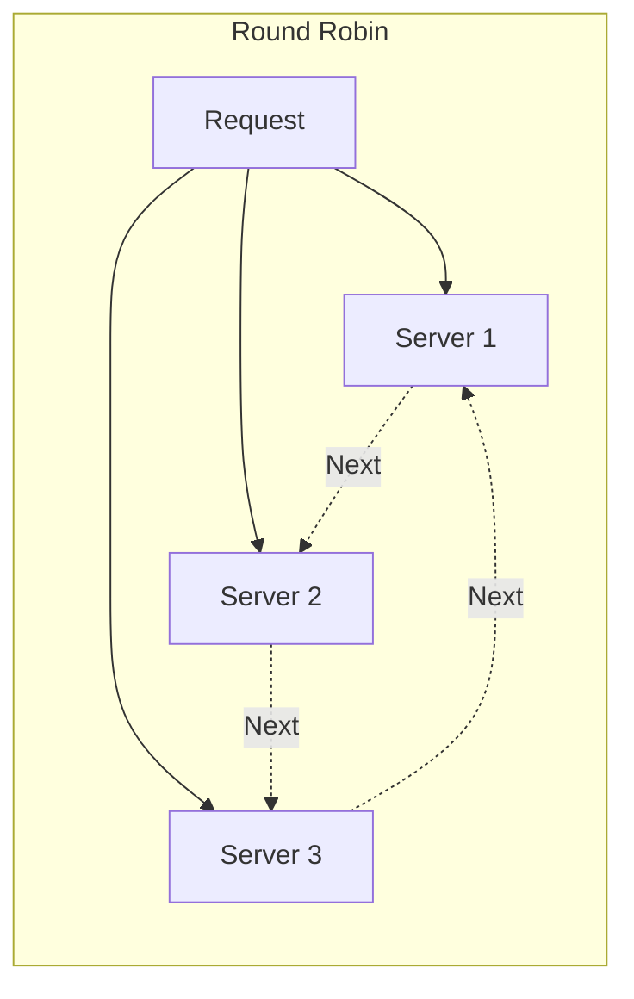
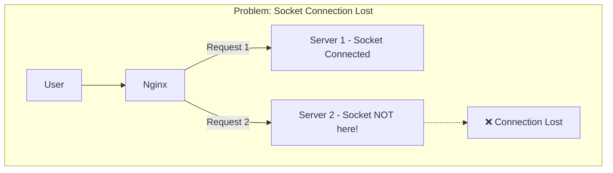
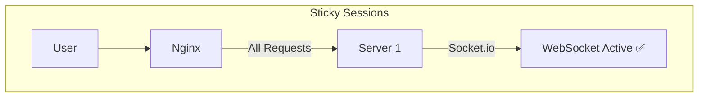

# Phase 2: Load Balancing Architecture

## Current Problem (Phase 1)



## Phase 2 Solution - Load Balancer



## Request Flow



## Load Balancing Strategies



| Strategy | Kaise kaam karta |
|----------|------------------|
| **Round Robin** | 1 → 2 → 3 → 1 → 2 → 3... |
| **Least Connections** | Jis server pe kam load, usko bhejo |
| **IP Hash** | Same user always same server |

## WebSocket Problem ⚠️



## Solution: Sticky Sessions



## Folder Structure (Phase 2)

```
system_design_pract/
├── nginx/
│   └── nginx.conf          # Load balancer config
├── server/
│   └── server.js           # Same code, multiple instances
├── client/
└── docker-compose.yml      # (Optional) Run all together
```

## What We'll Learn

| Concept | Implementation |
|---------|----------------|
| Load Balancing | Nginx |
| Multiple Instances | PM2 or manual |
| Sticky Sessions | For WebSocket |
| Health Checks | Server monitoring |
| Horizontal Scaling | Add more servers |

## Commands Preview

```bash
# Run 3 server instances
PORT=5001 node server.js
PORT=5002 node server.js
PORT=5003 node server.js

# Nginx routes traffic to all 3
```

---

Ready to implement? 🚀
